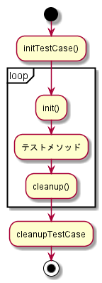

# Qt Test

# Overview

1. SampleTest
    - QTestの基本的な使い方
1. QSignalSpyTest
    - `QSignalSpy`によるシグナルのテスト

# 実行順序

- initTestCase()
    - init()
    - テストメソッド_1
    - cleanup()
    - init()
    - テストメソッド_2
    - cleanup()  
        :
- cleanupTestCase()

# Note

- プロジェクト名（proファイル名）は、`〇〇Test`としないとビルドに失敗する？
